# 🏦 VaultEdge — Enterprise Banking System

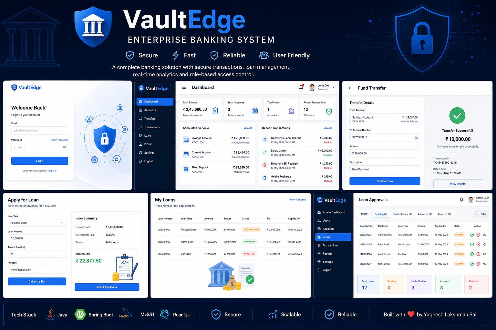

Enterprise Banking REST API built using Spring Boot and React.js with JWT authentication, secure fund transfers, loan management workflows, OTP verification, role-based access control, and transaction tracking.

---

## Tech Stack

| Category        | Technologies               |
| --------------- | -------------------------- |
| Backend         | Spring Boot 3.x            |
| Language        | Java 17                    |
| Security        | Spring Security, JWT       |
| Database        | MySQL                      |
| ORM             | Spring Data JPA, Hibernate |
| Frontend        | React.js, Axios            |
| Build Tool      | Maven                      |
| Testing         | JUnit 5, Mockito           |
| API Testing     | Postman                    |
| Version Control | Git, GitHub                |

---

## Repositories

| Layer    | Repository                                                                  |
| -------- | --------------------------------------------------------------------------- |
| Backend  | https://github.com/yagnesh-lakshman-sai/VaultEdge-Enterprise-Banking-System |
| Frontend | https://github.com/yagnesh-lakshman-sai/VaultEdge-frontend                  |

---

## Live Deployment

| Component    | URL         |
| ------------ | ----------- |
| Frontend     | Coming Soon |
| Backend API  | Coming Soon |
| Swagger Docs | Coming Soon |

---

## Features

### Authentication & Security

* JWT-based authentication
* Role-based authorization
* BCrypt password encryption
* OTP email verification
* Protected REST APIs

### Banking Operations

* Multi-account management
* Secure fund transfers
* Real-time balance updates
* Transaction history tracking
* Account status management

### Loan Management

* Loan application workflow
* EMI calculation system
* Loan approval and rejection workflow
* Loan tracking functionality

### Admin Module

* Review loan applications
* Approve or reject loans
* Filter loans by status
* Customer activity monitoring

---

## Application Screenshots

### Authentication Module

| Signin Page                        | Registration Page                       |
| --------------------------------- | --------------------------------------- |
| 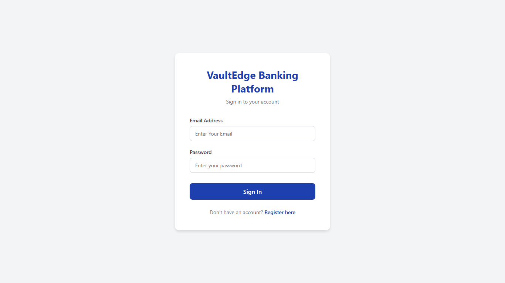 | 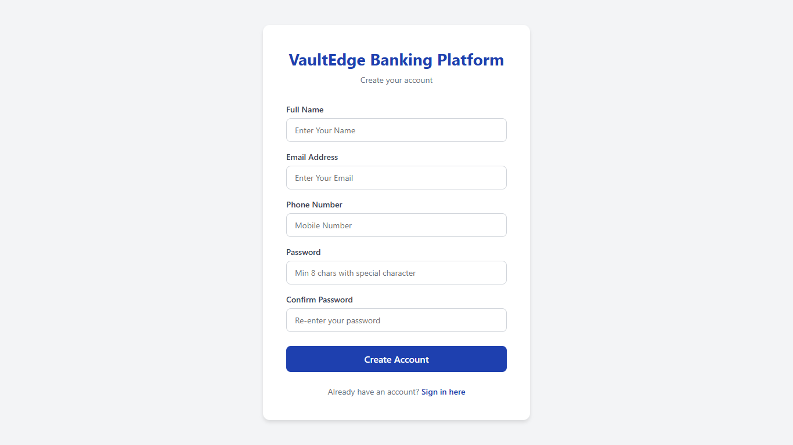 |

---

### Customer Dashboard

| Dashboard                                 | Accounts                                |
| ----------------------------------------- | --------------------------------------- |
| 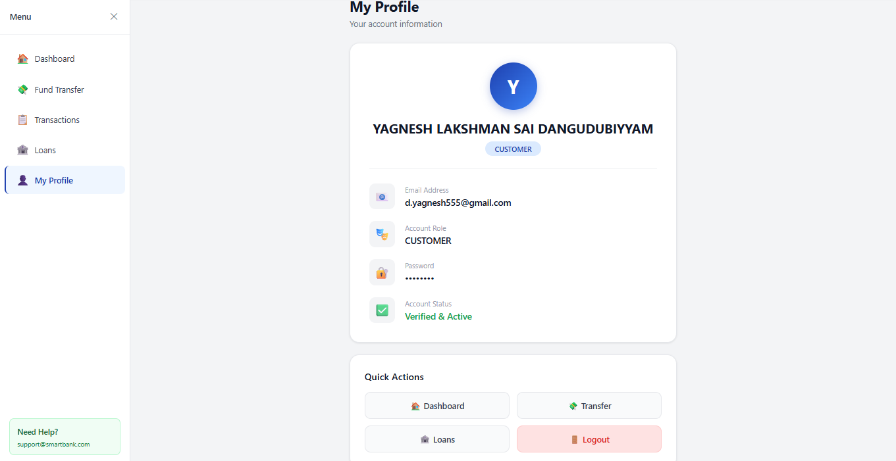 | 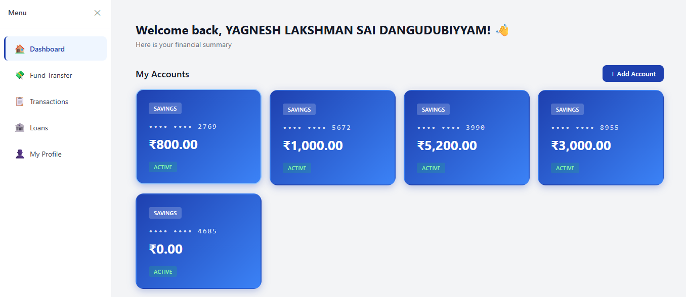 |

---

### Fund Transfer Module

| Transfer Form                           | Transfer Success                                        |
| --------------------------------------- | ------------------------------------------------------- |
| 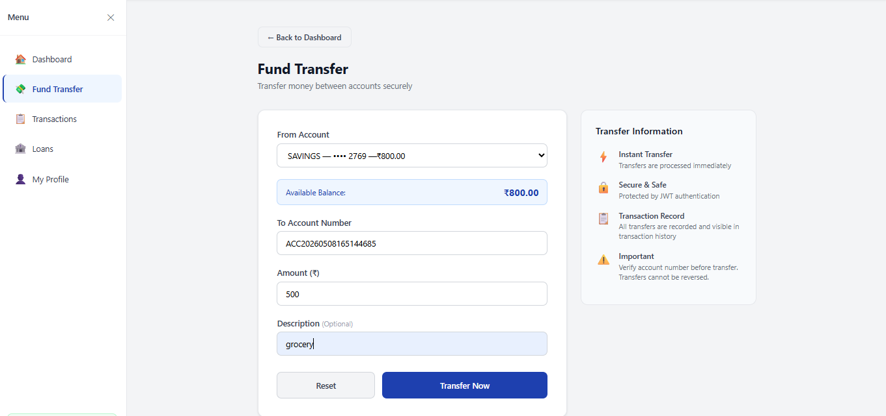 | 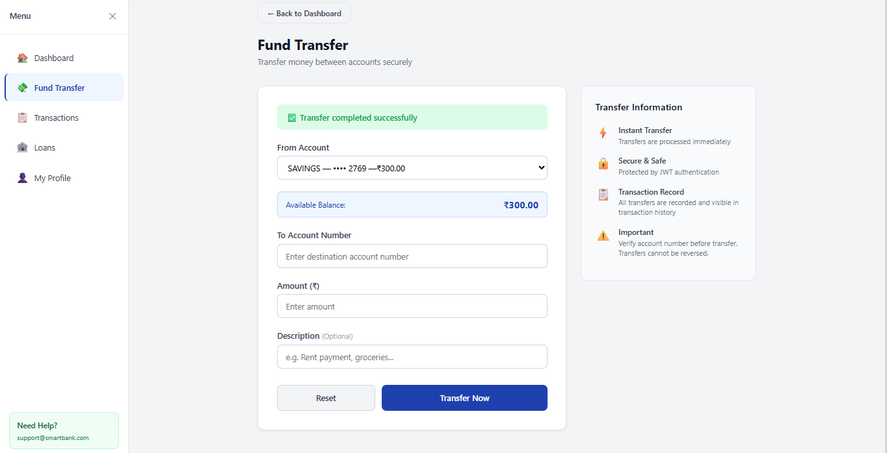 |

---

### Loan Management

| Loan Application                            | Loan Tracking                                     |
| ------------------------------------------- | ------------------------------------------------- |
| 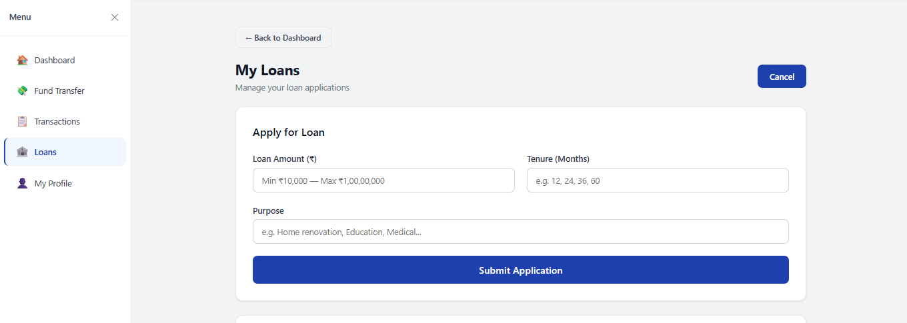 | 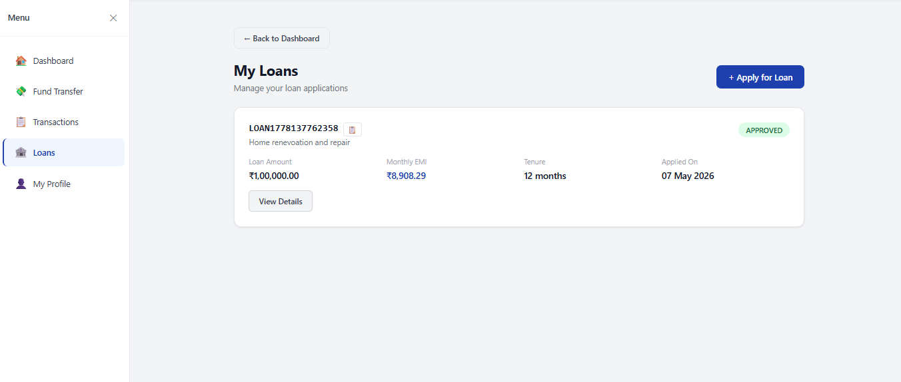 |

---

### Admin Module

| Admin Dashboard                                       | Loan Review                                     |
| ----------------------------------------------------- | ----------------------------------------------- |
| 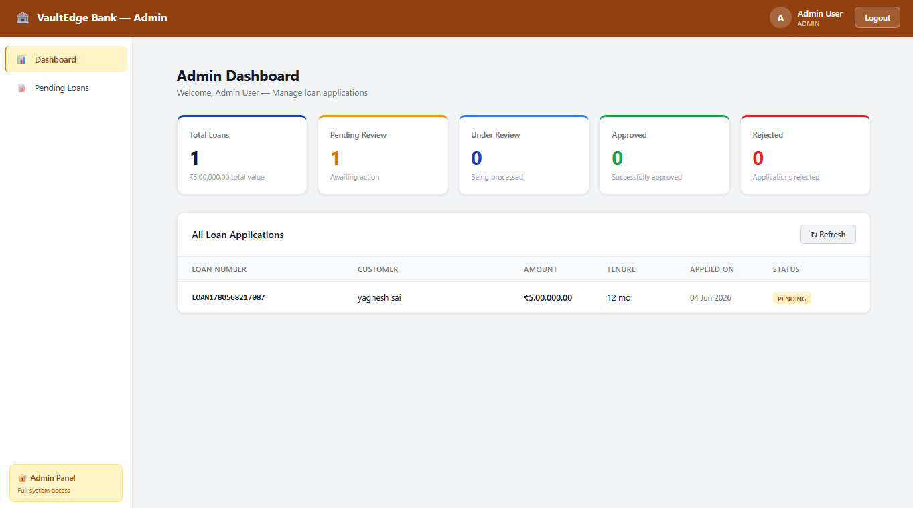 | 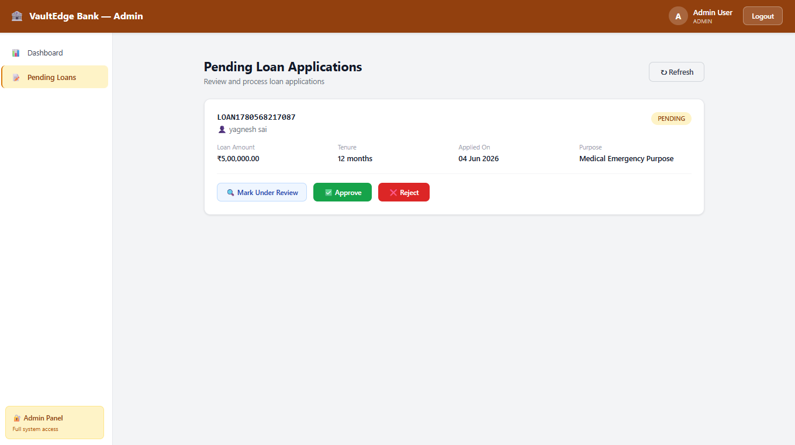 |

---

## 🏗️ Project Structure

```bash
smart-bank/
├── src/main/java/com/bank/smartbank/
│   ├── config/              # Configuration classes
│   │   └── DataSeeder.java
│   ├── controller/          # REST Controllers
│   │   ├── AuthController.java
│   │   ├── AccountController.java
│   │   ├── TransferController.java
│   │   ├── TransactionController.java
│   │   ├── LoanController.java
│   │   └── AdminController.java
│   ├── dto/                 # Data Transfer Objects
│   │   ├── common/
│   │   ├── auth/
│   │   ├── account/
│   │   ├── transaction/
│   │   └── loan/
│   ├── entity/              # JPA Entities
│   │   ├── User.java
│   │   ├── Account.java
│   │   ├── Transaction.java
│   │   └── Loan.java
│   ├── exception/           # Custom Exceptions
│   ├── repository/          # Spring Data Repositories
│   ├── security/            # Security Configuration
│   │   ├── JwtTokenProvider.java
│   │   ├── JwtAuthenticationFilter.java
│   │   ├── UserDetailsServiceImpl.java
│   │   ├── CurrentUser.java
│   │   └── SecurityConfig.java
│   ├── service/             # Business Logic
│   │   ├── AuthService.java
│   │   ├── AccountService.java
│   │   ├── TransactionService.java
│   │   ├── TransferService.java
│   │   └── LoanService.java
│   └── util/                # Utility Classes
│       ├── Constants.java
│       ├── OtpGenerator.java
│       ├── AccountNumberGenerator.java
│       └── EmailService.java
├── src/main/resources/
│   ├── application.yml
│   └── application-prod.yml
└── pom.xml
```

---

## Database Entities

* Users
* Accounts
* Transactions
* Loans

### Relationships

* One User → Multiple Accounts
* One Account → Multiple Transactions
* One User → Multiple Loans

---

## API Modules

| Module         | Description                       |
| -------------- | --------------------------------- |
| Authentication | Register, Login, OTP Verification |
| Accounts       | Account Creation & Retrieval      |
| Transfers      | Secure Fund Transfers             |
| Transactions   | Transaction Tracking              |
| Loans          | Loan Application & Management     |
| Admin          | Loan Review & Approval            |

---

## EMI Formula

```text
EMI = [P × R × (1 + R)^N] / [(1 + R)^N − 1]
```

Where:

* P = Principal Amount
* R = Monthly Interest Rate
* N = Loan Tenure in Months

---

## Local Setup

### Clone Repository

```bash
git clone https://github.com/yagnesh-lakshman-sai/VaultEdge-Enterprise-Banking-System.git
cd VaultEdge-Enterprise-Banking-System
```

### Configure Database

```properties
spring.datasource.url=jdbc:mysql://localhost:3306/smartbank
spring.datasource.username=root
spring.datasource.password=your_password
```

### Run Application

```bash
mvn spring-boot:run
```

Application URL:

```bash
http://localhost:8080
```

---

## Testing

```bash
mvn test
```

### Testing Tools

* JUnit 5
* Mockito
* Postman

---

## Deployment

| Layer    | Platform                   |
| -------- | -------------------------- |
| Frontend | Vercel                     |
| Backend  | Render / Railway / AWS EC2 |
| Database | MySQL                      |

---

## Engineering Concepts

* RESTful API Design
* Layered Architecture
* DTO Pattern
* Exception Handling
* JWT Authentication
* Transaction Management
* Role-Based Authorization
* BCrypt Password Encryption

---

## Future Improvements

* Docker Containerization
* CI/CD Pipeline Integration
* Redis Caching
* Kafka Event Streaming
* Microservices Migration

---

## 👨‍💻 Author

### Yagnesh Lakshman Sai

GitHub:
https://github.com/yagnesh-lakshman-sai

LinkedIn:
https://linkedin.com/in/yagnesh-lakshman-sai

Email:
[d.yagnesh.lakshman.sai@gmail.com](mailto:d.yagnesh.lakshman.sai@gmail.com)

---

## Project Highlights

* Developed secure banking workflows using Spring Boot
* Implemented JWT authentication and role-based authorization
* Designed scalable layered backend architecture
* Integrated React frontend with REST APIs
* Built loan processing and transaction management modules

---
